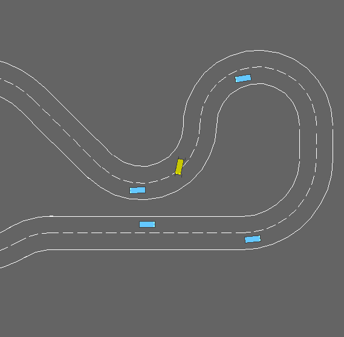

# INF581 Reinforcement learning project: Racing cars

This repository hosts our project made for the Ecole Polytechnique INF581 RL course. It contains all the required scripts to start a training for autonomous agent in our custom environment.

In our environment we train a simple model that controls the wheel and the trottle of a simple car (in yellow) that must stay on track and avoid other agents (in blue).




We used the project [highway-env](https://github.com/eleurent/highway-env) from eleurent as a baseline but built a custom fork upon it.

# Installation
Frist of all, you must create a new conda environmnent. 

```
conda create -n RLgym python=3.9
conda activate RLgym
```


Then install dependencies
```
pip install numpy matplotlib pygame moviepy tensorboard git+https://github.com/carlosluis/stable-baselines3@fix_tests 
```

Then you can clone this repository:
```
git clone git@github.com:MesmerV/RLracer.git 
```

Then you clone the fork of the highway environment that we built.

```
git clone https://github.com/maumlima/highway-env.git
```

Rename the repo highway-env into "highway_env"

And you finally install it:

```
pip install -e ./highway_env
```

# Usage

We loaded pre-trained models in the repo. You can observe how they behave using our scripts.
For instance you can watch our best model riding the track by executing:

```
python RLProject_ppo.py
```
